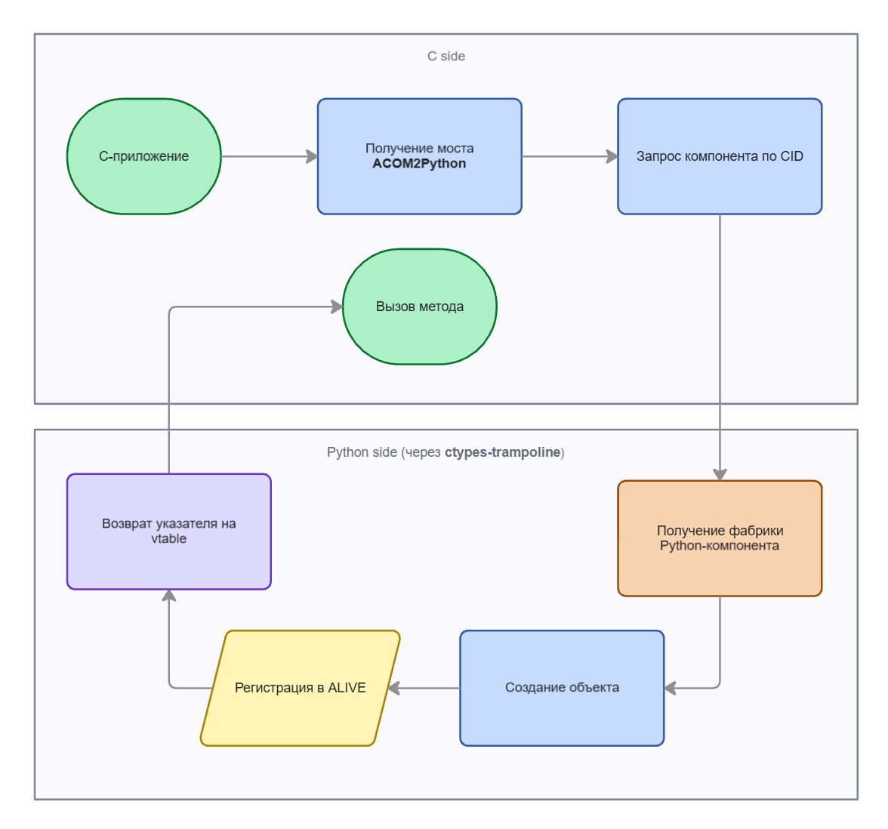

# Eco.ACOM2Python

C-side bridge that lets EcoOS components call Python implementations.

[](#)
[](#)
[](https://docs.python.org/3/extending/embedding.html)

## Overview

`Eco.ACOM2Python` is a native `EcoOS` component that embeds the `CPython`
interpreter and exposes a small interface (`IEcoACOM2Python`) for registering,
unregistering, and instantiating Python-implemented ACOM components from C.

When a native caller asks the interface bus for a component whose CID was
registered with this bridge, the bridge:

1. Looks up the corresponding Python module previously imported via
   `RegisterComponent`.
2. Pulls the Python-side factory (a `ctypes`-backed object exposing
   `IEcoComponentFactory`).
3. Forwards `Alloc` to that factory, returning the new instance to the
   native caller as a regular `IEcoUnknown` pointer.

From the native side it looks like just another `EcoOS` component — vtables,
`AddRef` / `Release`, `QueryInterface`. The Python details (interpreter
lifecycle, GIL, module import) are hidden inside the bridge.

## Features

- Hosts an embedded `CPython` interpreter inside the EcoOS process.
- Imports Python source files by path and looks up
  `get_component_factory()` — the export produced by the
  `eco_python2acom` `@factory` decorator.
- Keeps an `IEcoList1`-backed registry of `(CID, factory, module)` triples
  so factories survive `RegisterComponent` and are released cleanly on
  `UnRegisterComponent` / component destruction.
- Provides a small set of operations through `IEcoACOM2Python`:
  `RegisterComponent`, `UnRegisterComponent`, `QueryComponent`.

## Architecture



## Build & Run (Windows, MSVC + CPython)

### Prerequisites

| Tool            | Notes                                                                                                                       |
|-----------------|-----------------------------------------------------------------------------------------------------------------------------|
| `Visual Studio` | Use 2017 or newer; the toolset version is not pinned in the `.vcxproj`, so whichever **Build Tools** you have installed will be picked up. |
| `Python 3.x`    | Install from [python.org](https://www.python.org/downloads/). Pick the architecture (32-bit or 64-bit) that matches the `Platform` you intend to build (`Win32` ↔ 32-bit Python, `x64` ↔ 64-bit Python). For `Debug` configurations also tick **Download debug binaries** in the installer. |

### Environment variables (user scope)

| Variable           | Used by         | Notes                                                                                |
|--------------------|-----------------|--------------------------------------------------------------------------------------|
| `PYTHON_HOME`      | build & runtime | Path to `Python` installation (3.6 or newer).                                        |
| `ECO_FRAMEWORK`    | build           | Eco component sources (interfaces and per-component build outputs).                  |
| `ECO_FRAMEWORK_RT` | runtime         | Eco runtime libraries (`InterfaceBus1`, `MemoryManager1`, `FileSystemManagement1`). |

After setting them, restart Visual Studio so the values are picked up.

### Install the Python runtime package

The Python modules loaded by the bridge import `eco_python2acom`. Install the
package once into the same interpreter that `PYTHON_HOME` points at:

```cmd
pip install -e ..\Eco.Python2ACOM
```

### Build

Open `Eco.ACOM2Python\AssemblyFiles\Windows\VS_v100\EcoACOM2Python.sln` in
Visual Studio, choose a configuration and click **Build Solution**. The
bridge library and the unit-test executable land in
`BuildFiles\Windows\<Platform>\<Configuration>\`.

### Runtime layout next to `EcoACOM2PythonUnitTest.exe`

| File                                                  | Source                                                                  |
|-------------------------------------------------------|-------------------------------------------------------------------------|
| `219EDB626EF14B42BE16F93A566F1CC3.dll`                | bridge build output                                                     |
| `python3.dll`                                         | `$(PYTHON_HOME)\`                                                       |
| `53884AFC93C448ECAA929C8D3A562281.dll` (Eco.List1)    | `Eco.List1\BuildFiles\Windows\<Platform>\<Configuration>\`              |

The unit test (`EcoACOM2PythonUnitTest.exe`) covers four variants of the
calculator demo from `Eco.Python2ACOM/examples/server/calculator/`, selected
at compile time via the `ECO_TEST_VARIANT` define (`1`..`4`).

## See also

- [`Eco.Python2ACOM`](../Eco.Python2ACOM/README.md) — the Python-side runtime
  that authors components consumed by this bridge.
