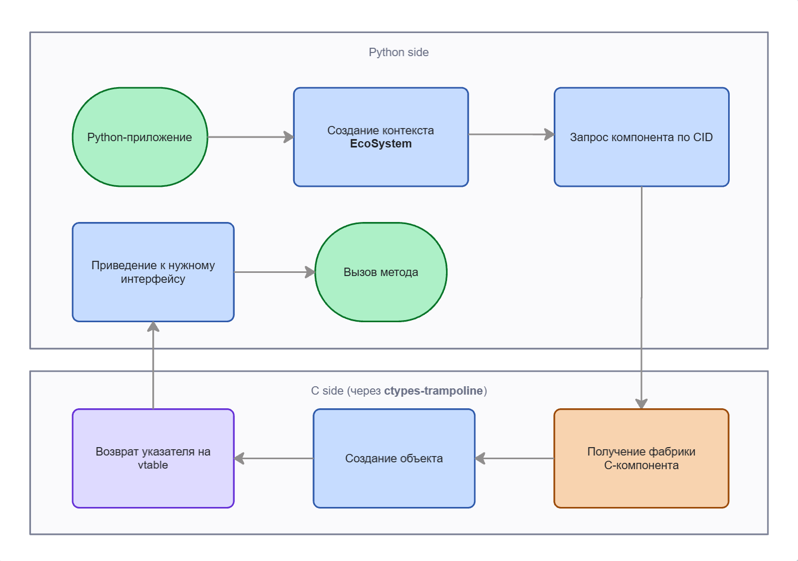

# Eco.Python2ACOM

Python bridge for ACOM component technology (EcoOS).

[](https://www.python.org/)
[](https://docs.python.org/3/library/ctypes.html)
[](https://python-poetry.org/)
[](https://squidfunk.github.io/mkdocs-material/)

## Overview

`eco-python2acom` is the Python half of the bridge between Python and `ACOM`
(_Adapted Component Object Model_) — the component architecture used by
`EcoOS`. It lets a Python program both **consume** existing `EcoOS` components
written in C and **expose** new components implemented in Python so that
native C code can use them.

The package is built around `ctypes` and a small set of declarative decorators
that hide vtable plumbing and pointer arithmetic behind regular-looking Python
classes.

## Features

- **Declarative interface and layout definitions** — `@interface`, `@model`,
  `@union`, `@stub` for describing `ACOM` interfaces and C-compatible structs.
- **Server-side ACOM components in Python** — `@component`, `@view`,
  `@factory` with full support for inclusion, containment and aggregation.
- **Runtime bootstrap** — `EcoSystem` brings up `InterfaceBus`,
  `MemoryManager`, `FileSystemManagement` in a single context manager.
- **Loader** — `EcoLibLoader` resolves library files in user
  directories and pulls out their factory export.
- **Concurrency-ready** — calls dispatch into the interpreter holding the GIL,
  so a Python component can be driven from multiple threads or `asyncio`.

## Architecture



## Installation

### Prerequisites

- Python **3.11+**
- `EcoOS` runtime libraries built and reachable via the `ECO_FRAMEWORK_RT`
  environment variable.
- For server-side scenarios — a working build of
  [`Eco.ACOM2Python`](../Eco.ACOM2Python/) embedded in the system.

### Editable install

For local development (recommended while iterating on examples):

```bash
poetry install
```

or with `pip`:

```bash
pip install -e .
```

## Documentation

Full reference is generated with `MkDocs Material` + `mkdocstrings` and lives
under [`docs/`](docs/). To preview locally:

```bash
poetry run mkdocs serve
```

Topical entry points:

| Topic | Page |
|---|---|
| Decorators (`@model`, `@interface`, `@view`, `@component`, `@factory`) | [`docs/decorators/`](docs/decorators/) |
| Type primitives, `Ptr`, `Array`, `UGUID`, errors, utils | [`docs/types/`](docs/types/) |
| GUIDs (IID, CID, GID) | [`docs/guids/`](docs/guids/) |
| Runtime (`EcoSystem`, `EcoLibLoader`, logging) | [`docs/runtime/`](docs/runtime/) |
| Built-in EcoOS interfaces | [`docs/interfaces/`](docs/interfaces/) |

## Examples

Runnable scenarios live under [`examples/`](examples/), each split into a
server side (the component, authored with the decorators) and a client side
(a host that boots `EcoSystem` and drives the component). Run any of them as a
module, e.g. `python -m examples.client.pattern.main`.

| Example | Demonstrates |
|---|---|
| [`calculator/`](examples/server/calculator/) | The four ACOM composition models — standalone, aggregation, containment, outer aggregator |
| [`pattern/`](examples/server/pattern/) | Returning a string from a Python component via `IEcoMemoryAllocator1` (the minimal `Eco.NewProject` template) |
| [`points/`](examples/server/points/) | Connection points — a container exposing two outgoing interfaces, `FindConnectionPoint` / `EnumConnectionPoints`, and multiple sinks (trace + animated chart) |
| [`concurrency/`](examples/server/concurrency/) | A shared-state component driven from threads and `asyncio` — racy vs lock-guarded increments, and overlapping blocking calls through the bridge |

The `calculator` server splits across four files:

| File | Demonstrates |
|---|---|
| `simple.py` | Standalone component implementing `IEcoCalculatorX` + `IEcoCalculatorY` |
| `inner.py` | Aggregatable component (`IEcoCalculatorX`-only) with a non-delegating `IEcoUnknown` |
| `inclusion.py` | Containment — owns an included `IEcoCalculatorX`, delegates arithmetic to it |
| `outer.py` | Outer aggregator that wraps an inner aggregatable calculator |

## Testing

The suite lives under [`tests/`](tests/) and is split by `pytest` marker:

| Marker | Location | Scope |
|---|---|---|
| `unit` | [`tests/unit/`](tests/unit/) | Fast, isolated tests of decorators, type primitives and runtime helpers |
| `integration` | [`tests/integration/`](tests/integration/) | End-to-end checks against the live runtime and the `Eco.Test` component, run against both the native and the bridge-hosted back-end |

```bash
pytest              # unit + integration (benchmark excluded)
pytest -m unit      # fast unit tests only
```

## Benchmark

A micro-benchmark under [`tests/integration/test_benchmark.py`](tests/integration/test_benchmark.py)
measures the cost of a single ACOM call from a Python host — once into the
native `dll` (Python -> C) and once into a Python component through the
bridge (Python -> C -> Python) — reporting throughput, latency percentiles and
heap growth. Run it explicitly:

```bash
pytest -m benchmark
```

## See also

- [`Eco.ACOM2Python`](../Eco.ACOM2Python/README.md) — the C-side bridge that
  loads Python modules, embeds `CPython`, and exposes Python factories to
  native EcoOS code.
